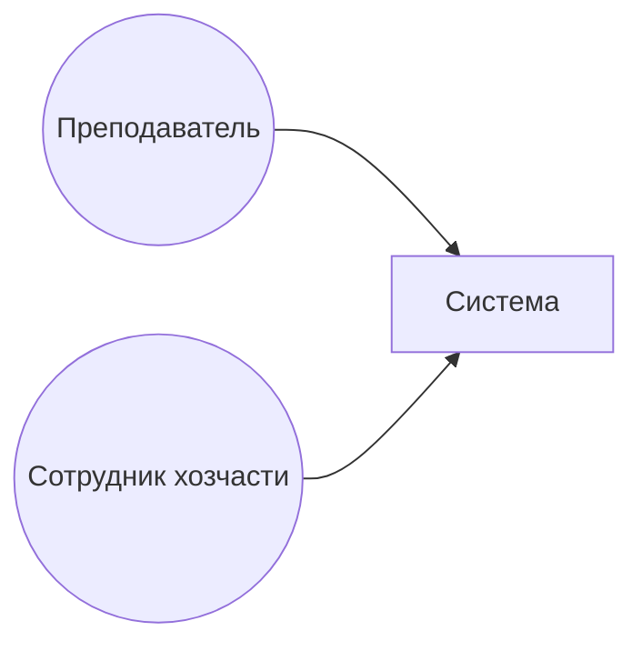

1. Проблема и цель
Отсутствие удобного инструмента планирования занятий, частые конфликты при бронировании аудиторий и оборудования из-за отсутствия единого расписания; преподаватели тратят много времени на поиск свободных помещений и согласование их использования с сотрудниками хозчасти.. 
Бизнес‑цель (измеримая): создать систему, позволяющую преподавателям находить свободные аудитории за $3$ минуты и оформлять заявки без конфликтов; сократить время согласования заявок сотрудником хозчасти до $5$ минут.
2. Границы системы

Входит:
- Поиск свободных аудиторий и оборудования по датам и времени.
- Бронирование ресурсов преподавателем.
- Управление заявками сотрудником хозчасти.
- Отображение расписания занятости.
- Уведомления о подтверждении или отклонении заявки.. 

Не входит:
- Система учёта студентов и преподавателей колледжа.
- Внешняя система контроля доступа к аудиториям.
- Интеграция со сторонними системами управления персоналом.
3. Заинтересованные стороны

| Стейкхолдер | Роль | Интересы / ожидания | Влияние | Интерес |
|:--- | :--- | :--- | :--- | :--- |
| Преподаватель | Пользователь | Быстро находить свободные аудитории, планировать занятия без конфликтов | Среднее | Высокий |
| Сотрудник хозчасти | Администратор | Контролировать расписание, предотвращать конфликты при бронировании | Высокое | Высокий |
| Руководитель кафедры | Заказчик | Повысить эффективность работы преподавателей, сократить время на планирование занятий | Высшее | Средний |
| Администрация колледжа | Инвестор | Снизить расходы за счёт эффективного использования помещений; повысить удовлетворённость студентов и сотрудников | Высшее | Высокий |
| Студент | Косвенный пользователь | Доступ к учебным аудиториям в удобное время | Низкое | Средний |
4. Ограничения
- Сроки, бюджет, технологии, законодательство (например, о персональных данных)
5. Контекст

6. Глоссарий

| Термин | Определение |
|:--- | :---|
| Аудитория | Помещение колледжа с фиксированным набором оборудования (мебель, проектор, доска), предназначенное для проведения занятий или мероприятий. |
| Ресурс | Любое оборудование или помещение, доступное для бронирования через систему. Примеры: аудитория, компьютерный класс, мультимедийный экран. |
| Бронирование | Заявка на использование ресурса в определённое время; после подтверждения бронированием считается занятым. |
| Конфликт заявок | Ситуация, когда два пользователя пытаются забронировать один ресурс одновременно на одно и то же время. Система должна предотвращать такие конфликты автоматически. |
| Календарь доступности | График, показывающий свободное и занятое время каждого ресурса. Позволяет преподавателям быстро находить доступные помещения. |

